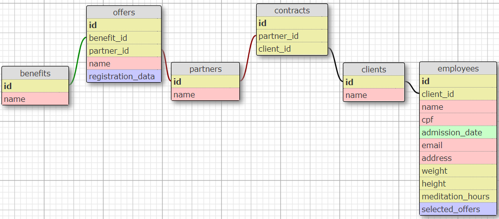

# Pipo Saúde Employee Registration App
***
## Project Description
This project simulates a registration form for new employees that will benefit from health insurance.

[See Online](https://pipo-saude-luizatoledo.herokuapp.com/ "Pipo Saúde Project")

## User Demo


## Documentation for Developers
### 1. Core
#### Database schema


As shown in the image above, the database was modeled with six entities:
* Benefits
* Offers
* Partners
* Contracts
* Clients
* Employees

##### Benefits, Offers and Partners
The Benefits table has only one attribute (besides id): name (string). It has a 'many to many' relationship with the Partners table, which also has only the name attribute (string).
Given the type of relation, they need a join table to represent each pair of benefit-partner. This is the Offers table, that has the attributes name (string) and registration_data (array of strings)

##### Partners, Contracts and Clients
The Partners table also has a 'many to many' ralationship with Clients (attribute name as string).
Therefore, the join table Contracts is there to represent the pairing of each partner and client.

##### Clients and Employees
The Employees table has a 'one to many' relationship with Clients. This means that a Client can only belong to one Employee, but one Employee can have many Clients. Therefore, their relationship is straightforward and doesn't need a join table.

The Employees table has 9 attributes (besides id and foreign keys):
* name - a string that identifies the person's full name
* cpf - a string that identifies brazilian CPF registration
* amission_date - the employment date
* email - a string of the employee's email
* address - a string of the employee's address
* weight - a number (integer or decimal) that represents the employee's weight in kilograms
* height - an integer that represents the employee's height in centimeters
* meditation_hours - a number that indicates the number of hours of meditation in the past 7 days
* selected_offers - a string containing the names of the offers that the employee has chosen

### 2. Source
#### About the code and motivation
This project was developed in the very beggining of my carreer, after my 9-week bootcamp at Le Wagon. It was a challange made by Pipo Saúde, a Brazilian HealthTech, to test my skills.
Therefore, I chose to use Ruby on Rails to write the server-side of the API mainly because it is the tool that I'm most familiar with - but I'm still learning so much from it.
Since Rails 6 has webpacker configured in it, the use of front end javascrip frameworks got easier. That was the reason why I chose to challenge myself to learn React.js and apply it for the first time in this project.

#### Tech, Framework, Tooling

* Ruby on Rails
* React.js
* HTML
* SCSS
* Bootstrap
* PostgreSQL
* Git and GitHub

#### Navigation

Here is a simple guide to the most important files and folders to understand the written logic of the code:

| File/Folder     | Purpose                                                                      |
| -------------   |----------------------------------------------------------------------------  |
| app/assets      | Contains the assets used in the application (images, SCSS stylesheets)       |
| app/controllers | Contains the logic of the Controllers for Rails' MVC structure               |
| app/javascript  | Contains all the React.js logic (the registration folder has all the actions,|
|                 | containers and reducers)                                                     |
| app/models      | Contains the entities of the database and all the validation logic for saving|
|                 | data in the DB                                                               |
| app/views       | In a pure RoR application, this folder would contain all the HTML rendering, |
|                 | but since React.js is being used, it only has the meta information of <head> |
|                 | in the application.html.erb file and the rendering of the React App in       |
|                 | home.html.erb                                                                |
| config/         | Contains configuration for the application. The only written logic is in the |
|                 | routes.rb file                                                               |
| db/             | Contains the current database schema, as well as the database migrations     |
| test/           | All Rails related tests                                                      |

Gemfile, Gemfile.lock and package.json are the folders that specifies Ruby Gem's and NPM libraries dependencies for the full application.

All other folders and files are used for setups, configurations and are automatically generated with rails new command line

### 3. Installation and Use

#### Check Ruby Version
```
ruby -v
```
Output should be something like ```ruby 2.6.6p146```
If not, install the right ruby version using [rbenv](https://github.com/rbenv/rbenv):
```
rbenv install 2.6.6
```
Set 2.6.6 version as default
```
rbenv global 2.6.6
```
Restart terminal
#### Install Rails
```
gem install rails -v 6.0
```
Restart terminal
#### Clone Repository
```
git clone git@github.com:luizatoledo/sallve_cart.git
cd sallve_cart
```
#### Install Gems and Dependencies
Using [Bundler](https://github.com/rubygems/bundler) and [Yarn](https://github.com/yarnpkg/yarn):
```
bundle
yarn
```
#### Initialize Database
```
rails db:create db:migrate
rails db:seed
```
#### Serve
```
rails s
webpack-dev-server
```
Go to localhost:3000 in browser

### 4. Testing

run rake test for Rails testing
run yarn jest for React testing

## API V1 Documentation
### Employees
#### Get all Employees
GET request
url: /api/v1/employees
returns an array with all the current Employees registered in database
Each object in the array has 2 keys:
* attributes, an object with all the employee's registered attributes
* available_offers, an array of Offers' instances that can be chosen by that employee
#### Create an Employee
POST request
url: /api/v1/employees
body has to be an object in which the keys are employee's attributes
### Clients
#### Get all Clients
GET request
url: /api/v1/clients
returns an array with all the current Clients registered in database
Each object in the array has 2 keys:
* client, an object with all the client's registered attributes
* client_offers, an array of Offers' instances that can provide for the employees

## Credits
Rails app generated with [lewagon/rails-templates](https://github.com/lewagon/rails-templates), created by the [Le Wagon coding bootcamp](https://www.lewagon.com) team.
